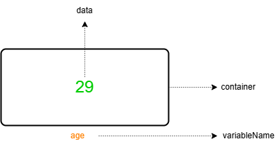

# Language Basics

Index

- Introduction
- Programming Fundamentals

---

Introduction

## Introduction

- A programming language is used to give instructions to a computer.
- Examples:

1. Javascript
2. Typescript
3. python

---

Programming Fundamentals

## Programming Fundamentals

- The basic concepts used in programming.

1.  Variables
2.  Conditions
3.  Loops
4.  Functions
5.  Class

---

Variables

## Variables

- Variables are like containers.
- we can use these containers to store data during program execution.
- we can give a unique name to a container so we can easily identify it.
- These named containers are called variables.
- We can access and modify the data in a container using its variable name.

---

Conditions

## Conditions

- A conditional statement executes a block of code when a specific condition is satisfied.

---

Loops

## Loops

- A loop executes a block of code repeatedly until a specific condition is satisfied.
- The loop stops when the condition is not satisfied.

---

Functions

## Functions

- A function is a block of reusable code that performs a specific task.
- We can create a function once and use it many times.
- A function is executed when it is called.
- We can call a function with different arguments to get different results.

---

Class

## Class

- A class is a blueprint.
- We can create a class with properties (information) and methods (functions).
- A class is used to create objects.
- We can pass different data to create different objects.
- We can create many objects from a single class.

---
