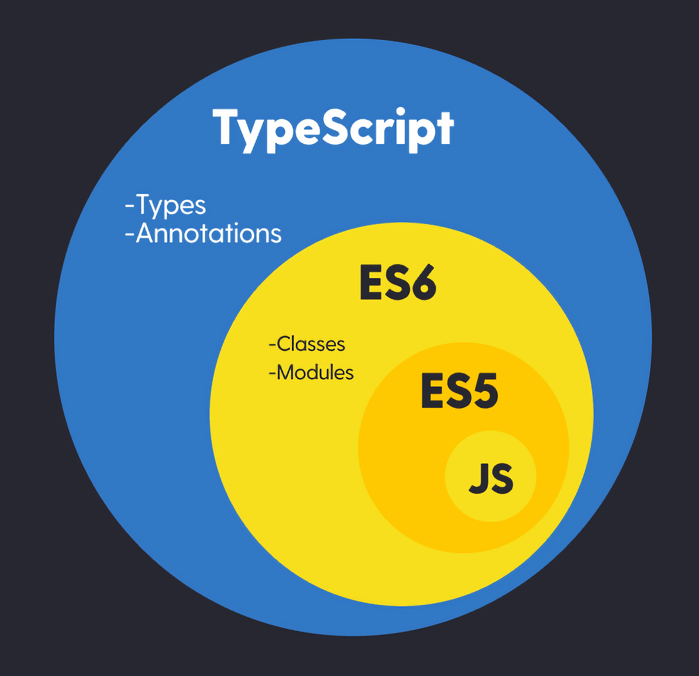
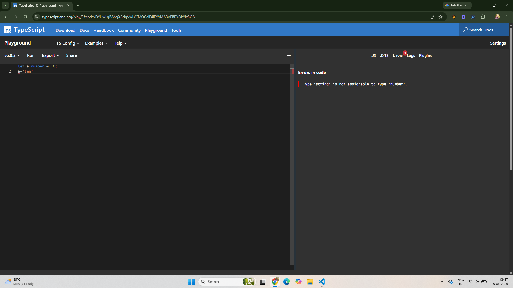

# Typescript

<details>
<summary>Index</summary>

## Index

- Introduction
- Typescript Data Types
- Type Safety
- JS vs TS
- Types
- Generics

</details>

---

<details>
<summary>Introduction</summary>

## Introduction

- TypeScript is a programming language built on top of JavaScript that adds static typing.
- TypeScript = JavaScript + Types
- TypeScript is a statically typed programming language.



### Uses

- TypeScript provides features like types, interfaces, and generics to catch errors while writing code.
- TypeScript checks for errors during compilation.

### Compilation

- We cannot run TypeScript code directly.
- TypeScript is a development-time language. Before running the code, TypeScript (.ts) must be converted into JavaScript (.js).
  

```terminal
tsc index.ts
```

</details>

---

<details>
<summary>Typescript Data Types</summary>

## Typescript Data Types

### Variables

- Syntax :

```ts
let variableName: type = value;
```

- Example :

```ts
let age: number = 20;
// age = "twenty";  // Error

age = 27; // No Error
console.log(age); // 27
```

### Primitive Datatypes

1. string
2. number
3. boolean
4. null
5. Undefined
6. any
7. unknown
8. never

```ts
// String
let myName: string = 'Ande Praveen';

// number
let myAge: number = 28;

// boolean
let isMale: boolean = true;

// null -> represents an intentionally empty value
let test: null = null;

// undefined
let abc: undefined = undefined;

// any -> we can assign anything like Javascript -> avoid the type checking
let a: any = 'Text';
a = 10;
a = true;
a = null;
a = undefined;

// unknown
let b: unknown;
console.log(typeof b);

// never ->  used for functions that never return a value
function throwError(): never {
	throw new Error('Something went wrong');
}
```

#### **any** vs **unknown**

- `any` type skips the type checking. it stores any value.
- `unknown` type checks the type checking before stores any value.

```ts
let a: any = 29;
// a.toUpperCase(); // Runtime Error

let b: unknown = 29;
// b.toUpperCase(); // Error

if (typeof b === 'string') {
	b.toUpperCase(); // Safe
}
```

</details>

---

<details>
<summary>Type Safety</summary>

## Type Safety

- Type safety means a variable can only store the correct type of value.
- It helps catch mistakes before the code runs.
- You can't use the wrong type of value by mistake.

```ts
let age: number = 20;
// age = "twenty";  // Error

age = 28; // No Error
console.log(age); // 27

// console.log(age.toUpperCase()); // Error
```

### Validation

```js index.js
function addTwo(num) {
	if (typeof num === number) {
		return num + 2;
	}

	return null;
}

addTwo(5);
```

```ts index.ts
function addTwo(num: number) {
	return num + 2;
}

// addTwo("five"); // ❌ Throws Error: Input must be a number
addTwo(5);
```

</details>

---

<details>
<summary>JS vs TS</summary>

## JS vs TS

- JS -> Javascript is a **Dynamically Typed** programming language.
- TS -> Typescript is a **Statically Typed** programming language.

### Javascript

```js index.js
/* -----> variable declaration & re-assignment <----- */

let a = 10;
a = 20;
a = 'twenty';

/* -----> Function Declaration <----- */

function user(name, age) {
	console.log(`My name is ${name} and My age is ${age}`);
}

user('praveen', 28); // My name is praveen and My age is 28
user(28, 'praveen'); // My name is 28 and My age is praveen
user('praveen'); // My name is praveen and My age is undefined
user(28); // My name is 28 and My age is undefined
```

### Typescript

```ts index.ts
/* -----> variable declaration & re-assignment <----- */

let a: number = 10;
a = 20; // No Error
// a = "twenty"; // Error

/* -----> Function Declaration <----- */
function user(name: string, age: number): void {
	console.log(`My name is ${name} and My age is ${age}`);
}

user('praveen', 28); // My name is praveen and My age is 28
// user(28, "praveen"); // Error : follow order of types
// user("praveen"); // Expected 2 arguments, but got 1
```

</details>

---

<details>
<summary>Types</summary>

## Types

- Types are used to specify the type of data.

1. type
2. interface
3. enum

### 1. type

- A type is used to define a custom data type.
- `type` is used to describe the structure of data.

```ts index.ts
// normal
const name: string = 'Ande Praveen';

// type
type MyNameType = string;
let myName: MyNameType = 'Praveen';
```

```ts index.ts
// normal
const user: {
	name: string;
	age: number;
} = {
	name: 'Prabhas',
	age: 38,
};

// type
type MyUserType = {
	name: string;
	age: number;
};

const user1: MyUserType = {
	name: 'Ande Praveen',
	age: 28,
};

const user2: MyUserType = {
	name: 'Mahesh babu',
	age: 45,
};
```

### 2.interface

- An interface is used to define the structure (shape) of an object.
- An interface defines the properties of an object.

```ts
// Object

// normal
const user: {
	name: string;
	age: number;
} = {
	name: 'Prabhas',
	age: 38,
};

// interface
interface IUser {
	name: string;
	age: number;
}

const user1: IUser = {
	name: 'Praveen',
	age: 28,
};

const user2: IUser = {
	name: 'Mahesh Babu',
	age: 45,
};
```

### 3. Enums

- An enum is used to define a group of named constant values.

```ts index.ts
// Numeric Enum
enum Status {
	PENDING,
	APPROVED,
	REJECTED,
}

let status: Status = Status.APPROVED;
console.log(status); // 1
```

```ts index.ts
// String Enum
enum Status {
	PENDING = 'PENDING',
	APPROVED = 'APPROVED',
	REJECTED = 'REJECTED',
}

let status: Status = Status.APPROVED;
console.log(status); // AAPROVED
```

</details>

---
